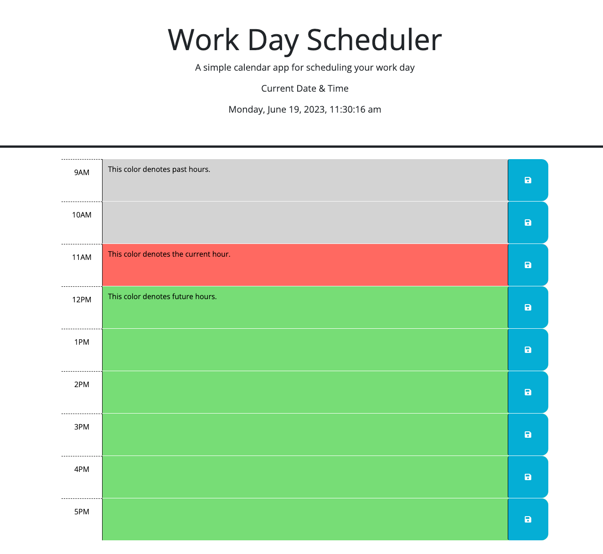

# work-day-scheduler

## Description
A work day scheduler - input your daily schedule from 9am - 5pm (standard working hours)

[Work Day Scheduler Link](https://uwlryoung.github.io/work-day-scheduler/)

## Screenshots and Explanation
The Work Day Scheduler follows the current time, and will continuously update so that you know where in the day you are and what tasks need to be completed. 

- Gray textbox = Denotes past hour(s).

- Orange Textbox = Denotes current hour.

- Green Textbox = Denotes futurer hour(s).

## Steps
1. Make your schedule for the workday by typing in what needs to be done/the things on your plate in the appropriate time. 
2. Click on the save button icon to the right of the textbox. 
3. If you want to delete (after already saving), erase all the text and click the save icon again.

## Usage
To help plan your work schedule.

## Credits / Used Sources
Layout/structure was pre-made by Bootcamp Spot

[dayjs](https://day.js.org/) 

[jquery](https://jquery.com/)

[bootstrap](https://getbootstrap.com/)

[fontawesome](https://fontawesome.com/start)

## Challenges To Work On / Future Updates to this Page
- Enable user be able to add future work dates. 
- Enable user to add more hours/change the hours in case their work starts earlier or ends later. 

## License
N/A

